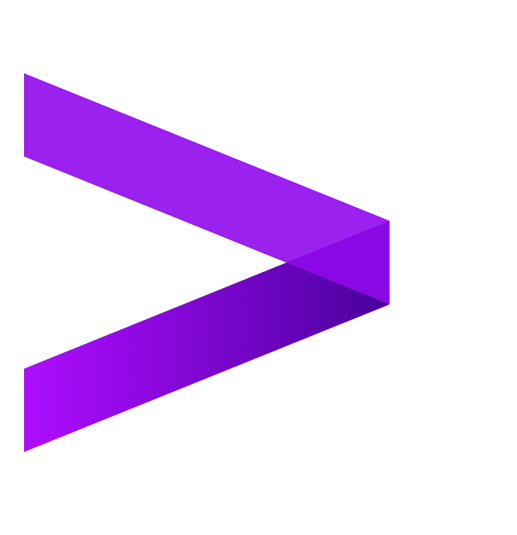
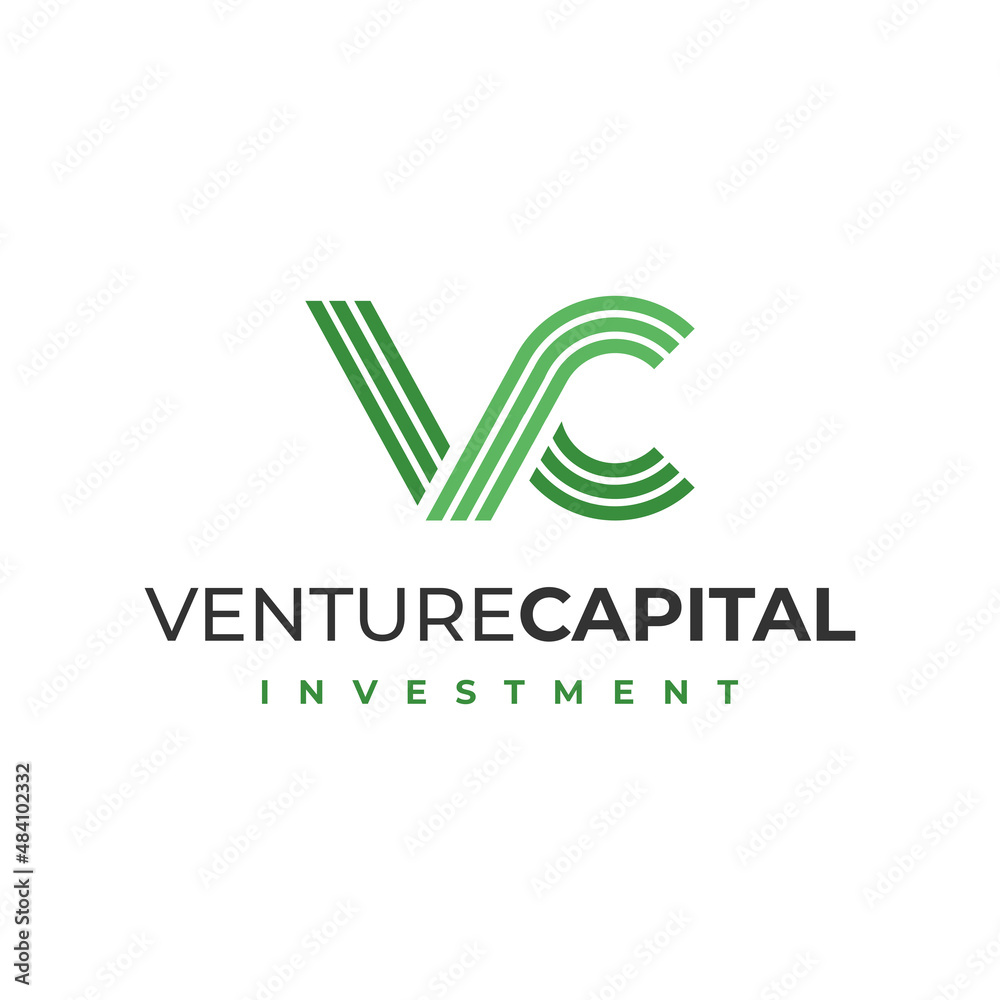

# INNOVATE VENTURES

  

Innovate Ventures is a website that offers users the possibility to get in touch with the reality of a venture capital firm. 
This was a university project for the course Hypermedia and Web Applications, and it actually was my first approach to website creation and deployment(in fact I failed to deploy it).

## Introduction

  

Our website is built for a Venture Capital firm: as asked in the project’s specifications we implemented
different pages to present the main aspects of the firm. In particular, we designed a Homepage and
pages for People working at the firm, for projects in which they invested in and for the relative
areas of investments. Moreover we added a Contact Us and an About Us page where the users can
find additional information and contact directly the firm.

## Structure 

#### People 👥
Our website is structured in the following way: in all pages landmarks are present and they are
the main instrument to navigate through the site, giving the user the ability to easily go to the
Homepage or all the other pages. In particular, the “All People” page displays all the team members
and gives the user the possibility to access, by clicking on a group link, the “specific person”
page where personal information (a short CV) can be found along the project’s he/she supervises
(accessible thanks to the respective transition link). 
Code-wise, inside the “pages” folder we have
created a “people” sub-folder with 2 files inside:
Index.vue : with the information related to all people, extracting them from the server using cards.
[id].vue : dynamically filled with the “specific person” information, identified by a parameter’s value.

#### Areas 🏖️ 🌲 💰
A very similar structure was used for to implement the section for the areas: the “All Areas”
page displays the various fields of investment of the firm and, once an area is chosen, the user can
get to the corresponding page using the group link provided. In these “Specific Area” pages, a brief
description can be found with the projects relative to the area, reachable thanks to a transition
link. These pages are in the folder “areas”, again inside of “pages”. More precisely, we have an
“Index.vue” file for the main area section and “[id].vue” for each of the specific pages. 

#### Projects 💡
Moreover,regarding the projects’ section, we once again have a main page where all the projects are displayed
and can be filtered by area using a filter. This is the method we used to implement the “Project
by area” group. The user can also click on one of the group links to reach the respective “specific
project page”, where we decided to show a detailed description of the project and 2 cards with
transition link annexed, allowing the user to go directly to the project’s supervisor or the relative
area. Again, in the “pages” folder, a “projects” sub-folder can be found with “Index.vue”, for
the main page, and “[id].vue” for the singular project pages. Another sub-folder of “pages” is
the “mostrelevant” folder, containing another “Index.vue” file used to implement a page with the
top 5 ranked projects of the firm, which is reachable from various links available in most of the
pages. Note that this page cannot be reached using landmarks. 

#### About us and Contact us 📞
To complete the website’s structure
we added a “About Us” page, with additional information on the VC firm, and a “Contact Us”
page, with address and ways to contact directly the firm. Code-wise they are, respectively, the
“About.vue” and “Contact.Vue” files that can be found inside “pages”.

## Database💻
Our server is mainly used to extract information requested from the database in which they are
stored. In fact, we created a database containing all the information displayed in our website,
such as area, projects and people. To extract the data needed we used the “get” method, in
particular: app.get(‘/people’, . . . ) to get information regarding all people and app.get(‘/people/:id’,
. . . ) for a specific person (including the projects he/she supervises) thanks to the value of “id”.
app.get(“/projects”, . . . ) and app.get(“/projects/:id”, . . . ) for projects.
app.get(“/areas”) app.get(“/areas/:id”) for areas.

## Components
The components we used are:
<ul>
  <li>Card.vue : to create cards for the “people” page, which contains name, role and an image
for each team member. We also added a link which lead to the personal page of the chosen
member. Props used here are: ‘title’, ‘subtitle’, ‘link’ and ‘img-link’.</li>
  <li>CardArea.vue : to create cards for the “areas” page, which contains the name of the area, a
descriptive image and the link to the specific page for the chosen area. Props used here are
‘title’, ‘link’ and ‘imm-link’.</li>
  <li> CardLoc.vue : to create cards used in the “projects” page and “mostrelevant” page. These
cards contain name of the project, the field they’re in, an image and a link leading to the
“specific project” page. Props used here are: ‘title’, ‘subtitle’, ‘link’ and ‘img-link’.</li>
   <li> SmallCard.vue : to create cards used in all the specific pages for people, areas and projects.
In the first case they are used to display all the project supervised by the chosen person, in
the second case they show projects of the chosen area and in the last case the supervisor of
the project. In all the cases links are present to reach the correspondent page. Props used
here are: ‘title’, ‘subtitle’ and ‘link’.</li>
   <li> SmallCardArea.vue : to create a smaller card used in the specific projects’ pages to show
which area they belong to. A link to the respective area is also present. Props used here are:
‘title’ and ‘link’.</li>
   <li> TextImage.vue : to position a group of text and image side by side, that when the screen
becomes smaller, moves the text below the image. Props used here are: ‘isReverse’ , ‘description’
and ‘image’.</li>
   <li> TheHeader.vue : to create the header of the page, with links to the Homepage, Areas,
Projects, People, Contact Us and About Us.</li>
     <li> TheFooter.vue : to create the footer of the page, containing a logo and some general information
and contacts of the firm.</li>
</ul> 

## SEO & Accessibility
Regarding the SEO Accessibility part we added metadata to our website in 2 ways. Firstly we
acted on a global level by modifying the nuxt.config.ts file, adding metadata such as the title of
the website, a brief description, charset, viewport, language, authors and keywords. After that,
we moved to a local level, to have more personalized metadata for each page. We added to every
page the following metadata: title, description and keywords with specific information on the page
considered.

## Deployment
The chosen Hosting Service is GitHub Pages, with a SSG (Static Site Generation) rendering mode.
In this way, we are able to host a static website from a repository, generating all the pages and
putting them online in a static way thanks to GitHub Pages. We made this choice because, from
our point of view, it is both easy to implement and efficient, especially for a website of a VC firm,
which does not require big dynamic components. Following the previous choice, for our server we
selected a different port (3001) from the one used by default by Nuxt (3000).

